# 📰 SSAFYNEWS — 실시간 뉴스 큐레이션 & RAG 챗봇 플랫폼

> RSS → Kafka → Flink 실시간 수집·처리, pgvector + Elasticsearch 하이브리드 검색,
> LangChain 기반 RAG 챗봇, Spark + Airflow 일일 분석 리포트까지 아우르는 풀스택 뉴스 큐레이션 플랫폼입니다.

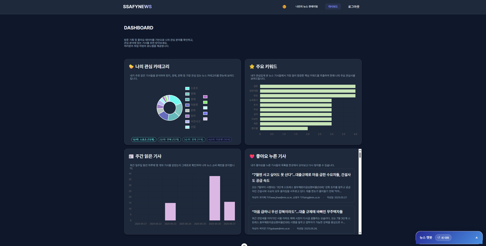

<sub>SSAFY 13기 관통 프로젝트 · 2인 팀 · Data 파이프라인 / Backend / Frontend / RAG 챗봇 풀스택 구현</sub>

---

## 프로젝트 개요
이 프로젝트는 뉴스 데이터를 수집·처리·분석하여 사용자에게 맞춤형 뉴스 큐레이션 서비스를 제공하는 종합 플랫폼입니다. 프론트엔드, 백엔드, 데이터 파이프라인으로 구성된 모노레포 형태의 풀스택 애플리케이션입니다.

정보 과잉 시대에 **원하는 뉴스를 빠르게 찾고, 기사에 대한 의문을 즉시 해결**할 수 있는 통합 환경을 목표로 합니다. 실시간(Flink)과 배치(Spark/Airflow) 처리를 융합하고, 의미 기반(pgvector)·키워드(Elasticsearch) 검색을 모두 지원하며, 기사 본문을 근거로 답하는 RAG 챗봇을 결합한 것이 특징입니다.

---

## 시스템 아키텍처

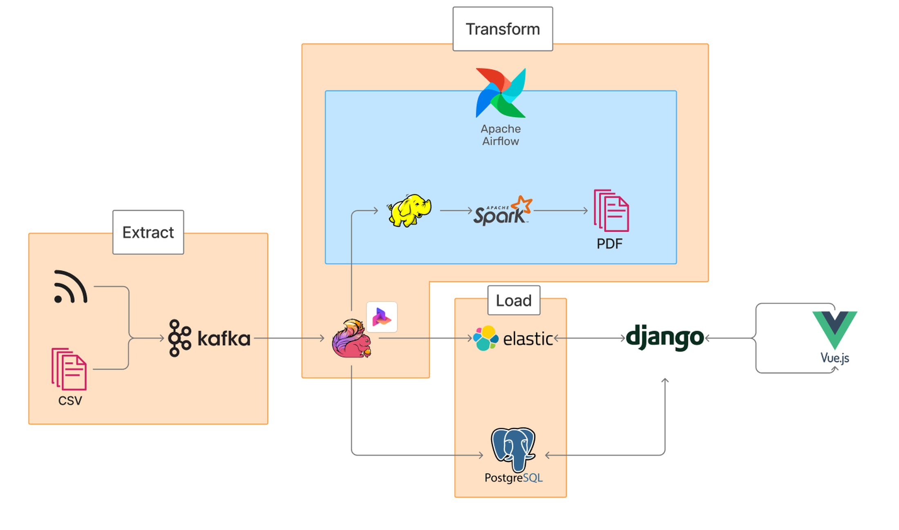

<sub>RSS·CSV → **Kafka** → **Flink**(실시간) / **Spark·Airflow**(배치+PDF) → **PostgreSQL(pgvector)·Elasticsearch** → **Django** → **Vue 3**</sub>

### 1. 프론트엔드 ([front-pjt](./front-pjt/README.md))
- **기술 스택**: Vue 3, Vite, Pinia, Vue Router, Chart.js
- **주요 기능**:
  - 회원가입 / 로그인 (JWT 기반 인증)
  - 맞춤형 뉴스 큐레이팅 및 추천 피드
  - 뉴스 상세 / 좋아요 / 관련 뉴스
  - 사용자 활동 시각화 대시보드 (Chart.js)
  - 뉴스 검색

### 2. 백엔드 ([backend-pjt](./backend-pjt/README.md))
- **기술 스택**: Python 3.10, Django 5.1 + Django REST Framework, PostgreSQL + pgvector, Elasticsearch 8.17, OpenAI / LangChain
- **인증**: JWT (djangorestframework-simplejwt + dj-rest-auth + django-allauth)
- **주요 기능**:
  - RESTful API 서비스
  - 사용자 인증 및 계정 관리
  - 뉴스 데이터 제공 및 좋아요
  - pgvector 기반 벡터(의미) 검색 및 유사 기사 추천
  - Elasticsearch 기반 텍스트 검색 / 추천 / 자동완성

### 3. 데이터 파이프라인 ([data-pjt](./data-pjt/README.md))
- **기술 스택**: Apache Kafka, Apache Flink(PyFlink), Apache Spark, Apache Airflow, OpenAI API
- **주요 구성요소**:
  - **Producer**: 매일경제 RSS 수집 후 Kafka 전송
  - **Consumer**: Kafka → Flink 실시간 수신 → OpenAI 전처리(키워드/임베딩/분류) → PostgreSQL + Elasticsearch 저장
  - **Batch**: Airflow + Spark 기반 일일 리포트 배치 환경 ([data-pjt/batch](./data-pjt/batch/README.md))

---

## 화면 미리보기

### AI 맞춤 추천 메인 & 뉴스 리스트
pgvector 유사도 기반 개인화 추천 피드와, 다중 태그·카테고리·좋아요/댓글 카운터로 한눈에 비교 가능한 뉴스 리스트입니다.

| AI 맞춤 추천 메인 | 카테고리·태그·좋아요 리스트 |
|:---:|:---:|
| 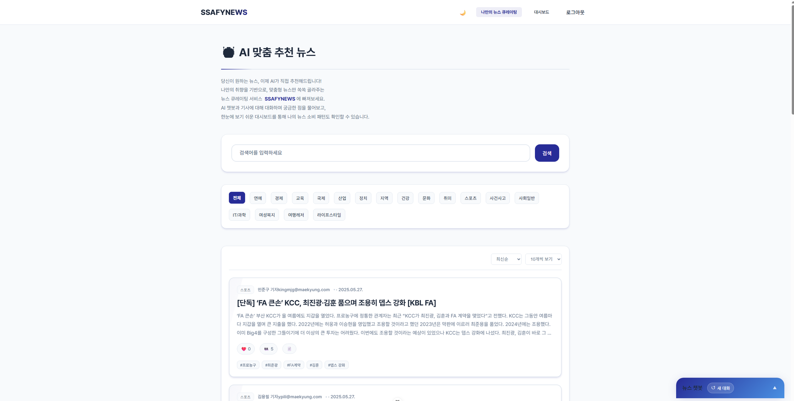 | 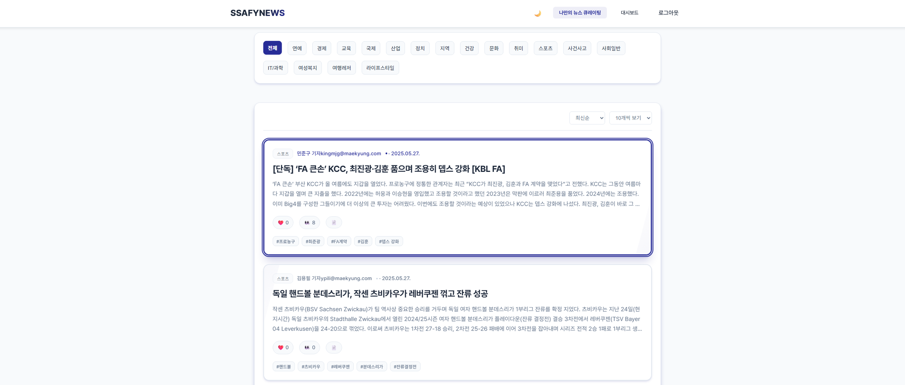 |

### 좋아요 한 번이 만드는 임베딩 기반 추천 흐름
기사에 좋아요를 누르면 pgvector 유사도 계산을 거쳐 추천 카드와 "좋아요한 기사" 패널까지 즉시 반영됩니다.

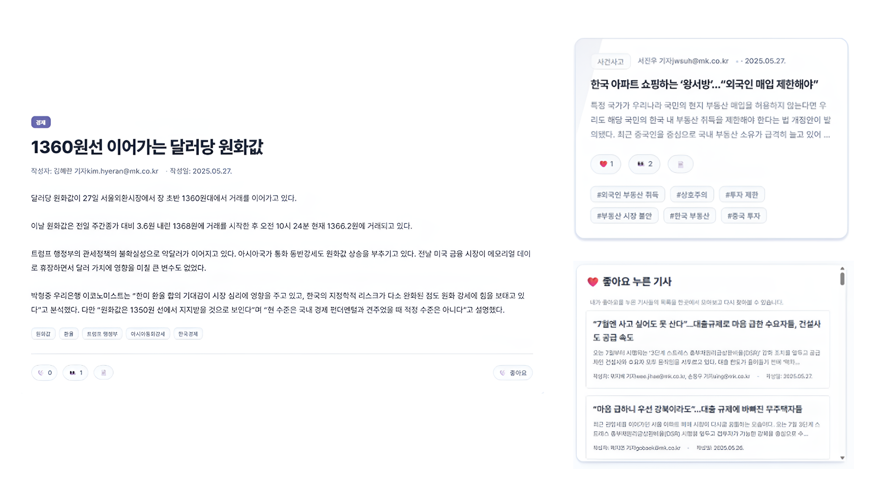

### 뉴스 상세 + RAG 챗봇
기사 본문을 근거로 챗봇이 즉시 답변하며, 좋아요·관련 기사 사이드바를 함께 제공합니다.

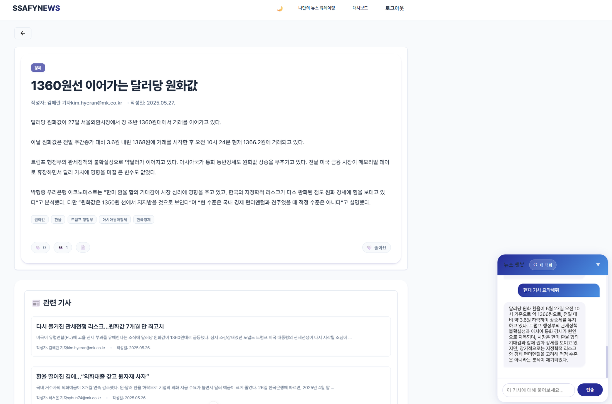

**RAG 챗봇 시연** — 새 대화 → 카테고리 검색 응답(요약 + 바로가기) → 기사 요약 (LangChain 기반)

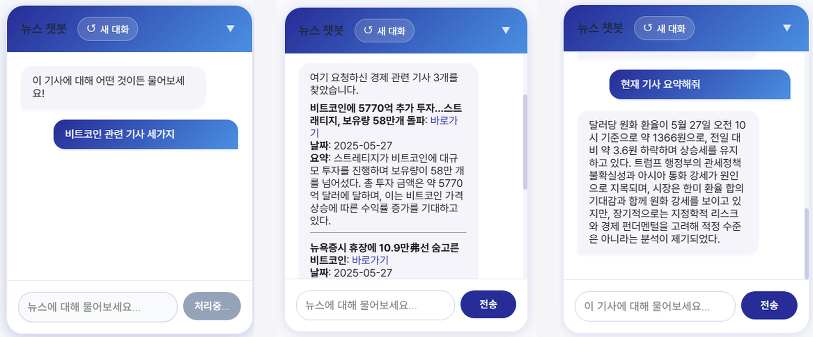

### 개인 대시보드 & 모바일 반응형
관심 카테고리 · 주요 키워드 · 주간 읽은 기사 · 좋아요한 기사를 시각화하며, 동일 콘텐츠를 모바일 폭에서도 손실 없이 큐레이팅합니다.

| 개인 대시보드 (라이트 모드) | 모바일 반응형 UI |
|:---:|:---:|
| 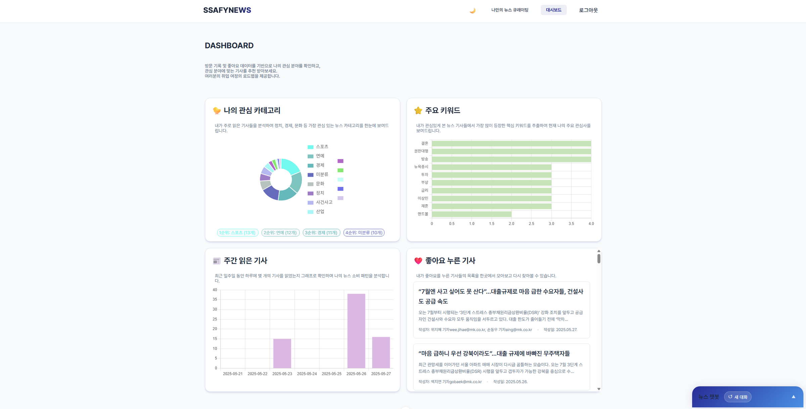 | 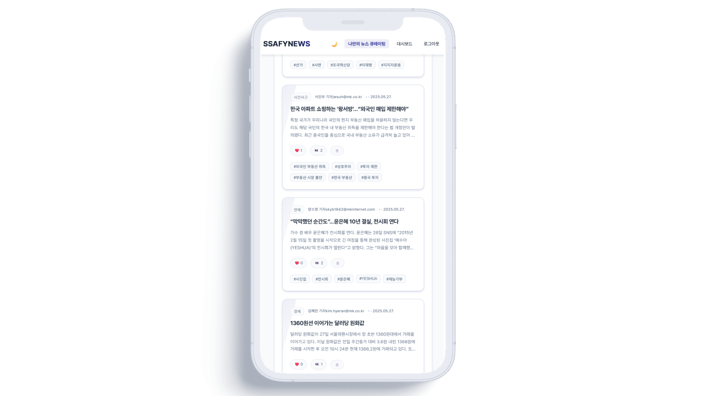 |

### 인증 (회원가입 / 로그인)
| 회원가입 | 로그인 |
|:---:|:---:|
|  | 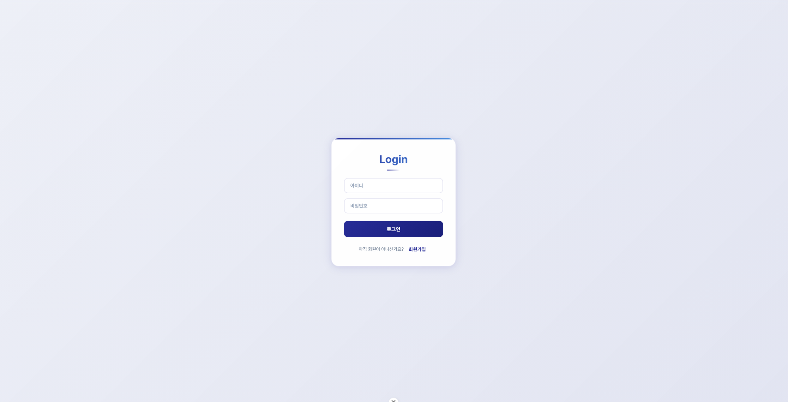 |

---

## 주요 기능
1. **맞춤형 뉴스 큐레이션**
   - 사용자 관심사 기반 뉴스 추천
   - 실시간 뉴스 수집 및 업데이트
   - 개인화된 뉴스 피드 및 대시보드

2. **고급 검색 기능**
   - pgvector 기반 벡터(의미) 검색
   - Elasticsearch 기반 텍스트(키워드) 검색
   - 카테고리 / 날짜 필터링 및 정렬

3. **RAG 챗봇**
   - 기사 본문을 근거로 한 맥락 기반 질의응답
   - 카테고리 검색·요약 응답 (LangChain)

4. **데이터 처리 및 분석**
   - Kafka + Flink 실시간 스트리밍 처리
   - OpenAI(gpt-4o-mini, text-embedding-3-small) 기반 전처리
   - Airflow + Spark 기반 배치 처리 및 일일 분석 리포트 자동 생성

---

## 기술적 특징
- **실시간 + 배치 융합**: Kafka + Flink(PyFlink) 스트리밍과 Spark + Airflow 배치 처리를 함께 설계
- **AI 전처리**: OpenAI API 기반 키워드 추출 · 임베딩 · 카테고리 분류
- **하이브리드 검색**: pgvector 벡터 검색과 Elasticsearch 텍스트 검색의 조합
- **RAG 챗봇**: LangChain으로 기사 본문 근거 기반 답변 제공
- **보안**: JWT 기반 사용자 인증 및 권한 관리

### 일일 분석 리포트 자동 생성
Airflow DAG가 매일 자동 실행되어 카테고리별 기사 수 · Top 10 키워드 · 시간대별 발행량을 Spark로 분석하고 PDF 리포트로 발행합니다.

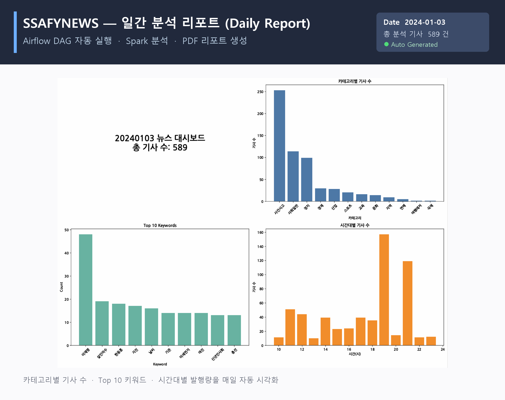

---

## 프로젝트 구조
```
├── front-pjt/          # 프론트엔드 (Vue 3 + Vite)
├── backend-pjt/        # 백엔드 API 서버 (Django + DRF)
├── data-pjt/           # 데이터 파이프라인
│   ├── producer/       # RSS → Kafka
│   ├── consumer/       # Kafka → Flink → 전처리 → 저장
│   └── batch/          # Airflow + Spark 배치 환경
└── img/                # README용 이미지
```

## 전체 구동 순서
1. **데이터 파이프라인** ([data-pjt](./data-pjt/README.md)): Kafka 기동 → Consumer(Flink) 실행 → Producer 실행 → 뉴스 수집·전처리·저장
2. **백엔드** ([backend-pjt](./backend-pjt/README.md)): PostgreSQL/Elasticsearch 준비 → 마이그레이션 → `runserver` (기본 8000)
3. **프론트엔드** ([front-pjt](./front-pjt/README.md)): `.env`에 백엔드 주소 설정 → `npm install` → `npm run dev`
