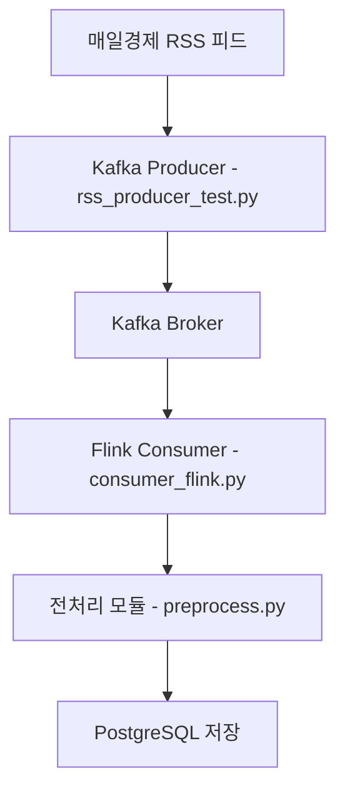

📝 프로젝트 기획 및 진행 보고서
===================

## 25년 04월 11일


프로젝트명
-----

**실시간 뉴스 수집 및 PostgreSQL 저장 시스템 구축**

* * *

1\. 🎯 프로젝트 개요
--------------

현대 사회에서 정보는 실시간으로 생성되고 확산되며, 특히 뉴스 데이터는 시의성과 신뢰성이 중요한 자산이다. 본 프로젝트는 RSS 피드 기반으로 뉴스 데이터를 실시간 수집하고, 해당 데이터를 웹 크롤링, 자연어 처리(TF-IDF, 임베딩)를 통해 가공한 뒤 PostgreSQL에 저장한다. 이 과정을 통해 데이터 흐름 및 저장 관리 원리를 실습하고, 이후 데이터 분석 및 검색 시스템 개발의 기반을 마련하는 것이 목적이다.

* * *

2\. 🔧 핵심 기능 요약
---------------

*   RSS 피드를 활용한 뉴스 메타데이터 수집 (제목, 링크, 발행일, 카테고리)
    
*   웹 크롤링 기반 본문 및 기자명 수집
    
*   TF-IDF로 핵심 키워드 자동 추출
    
*   KoSBERT 모델을 활용한 문장 임베딩 생성
    
*   PostgreSQL 데이터베이스 연동 및 중복 제거 저장
    
*   전체 흐름에서의 예외처리 및 에러 로깅 적용
    

* * *

3\. 🧩 데이터 수집 및 저장 흐름
---------------------

### 3-1. **RSS 피드 분석 및 수집 자동화**

*   `feedparser` 라이브러리를 사용하여 뉴스 메타데이터 자동 수집
    
*   매일경제 사회면 RSS (`https://www.mk.co.kr/rss/30100041/`) 기준
    
*   각 entry에서 기사 제목, URL, 발행일, 카테고리 추출
    

### 3-2. **뉴스 본문 및 기자명 수집**

*   `requests`, `BeautifulSoup`을 사용한 HTML 크롤링
    
*   `<div class="news_cnt_detail_wrap">` 내부 `p` 태그 활용
    
*   `figcaption`, `author` 영역 등을 통해 다양한 기사 포맷 대응
    

### 3-3. **콘텐츠 정제 및 분석**

*   TF-IDF 기반 키워드 추출 (`TfidfVectorizer`)
    
    *   불용어 제거 및 score 기반으로 상위 키워드 선택
        
*   KoSBERT 임베딩 생성 (`jhgan/ko-sbert-nli`)
    
    *   후속 추천·유사도 분석, 클러스터링 기반 검색 시스템 확장 가능
        

### 3-4. **데이터베이스 저장**

*   `psycopg2`를 이용해 PostgreSQL 연동
    
*   URL 기준 중복 체크 후 저장 여부 결정
    
*   키워드(JSON) 및 임베딩(Vector List)을 포함한 정형 저장
    

* * *

4\. 💾 DB 테이블 설계 (news\_article)
--------------------------------

| 필드명      | 타입        | 설명                       |
| ----------- | ----------- | -------------------------- |
| id          | SERIAL (PK) | 고유 ID                    |
| title       | TEXT        | 기사 제목                  |
| writer      | TEXT        | 작성 기자                  |
| write\_date | TIMESTAMP   | 발행일                     |
| category    | TEXT        | 카테고리                   |
| content     | TEXT        | 본문 내용                  |
| url         | TEXT        | 기사 링크 (중복 체크 기준) |
| keywords    | JSON        | TF-IDF 기반 키워드 리스트  |
| embedding   | FLOAT\[\]   | KoSBERT 임베딩 벡터        |

> 🔐 데이터 무결성 확보를 위해 `url`에 Unique 제약 조건 권장

* * *

5\. 🛠 기술 스택 및 도구
-----------------

| 분류   | 도구/기술                           | 설명                      |
| ------ | ----------------------------------- | ------------------------- |
| 언어   | Python 3                            | 전체 프로세스 구현        |
| 크롤링 | feedparser, BeautifulSoup, requests | RSS 및 웹 콘텐츠 수집     |
| 분석   | scikit-learn, sentence-transformers | 키워드 및 임베딩 처리     |
| DB     | PostgreSQL, psycopg2                | 데이터 저장소             |
| 보안   | dotenv                              | DB 정보 등 환경 변수 관리 |

* * *

6\. 📈 전체 프로세스 흐름도
------------------

```markdown
1. RSS 피드 수집
   └─> 2. 기사 링크 수집
        └─> 3. 본문 및 기자명 크롤링
              ├─> 4. TF-IDF 키워드 추출
              └─> 5. 문장 임베딩 생성
                   └─> 6. 중복 확인 및 DB 저장

```

* * *

7\. 📌 실행 절차
------------

```bash
# 1. .env 파일에 PostgreSQL 정보 기입
DB_USERNAME=your_id
DB_PASSWORD=your_pw

# 2. 실행
python main.py
```

* * *

8\. ✅ 기대 효과 및 학습 성과
-------------------

### 🎯 실무 적용

*   실제 뉴스 데이터를 대상으로 ETL 흐름을 학습함으로써 **데이터 파이프라인의 기초 역량** 확보
    
*   DB 연동을 통해 **데이터 무결성과 저장 관리 이론을 실전 적용**
    

### 🧠 기술 내재화

*   자연어 처리에서 **키워드 추출과 임베딩 개념 실습**
    
*   다양한 HTML 구조에 대응하는 **웹 크롤링 로직 설계 능력 향상**
    
*   예외처리, 중복 제거, 환경 변수 관리 등 **서비스화 고려 프로그래밍 습득**
    

* * *

9\. 🔭 확장 가능성 제안
----------------

| 확장 방향        | 설명                                           |
| ---------------- | ---------------------------------------------- |
| 뉴스 검색 시스템 | 임베딩 벡터를 활용한 유사 기사 추천 가능       |
| 대시보드 시각화  | 수집된 뉴스의 키워드 및 카테고리별 통계 분석   |
| 크롤러 스케줄링  | `cron`, `Airflow` 등을 통한 주기적 자동화 가능 |
| 다중 피드 수집   | 다양한 언론사 RSS 피드 통합 수집 및 비교 분석  |

* * *

✨ 부록: 참고 기술 링크
--------------

*   feedparser 문서
    
*   BeautifulSoup4 문서
    
*   KoSBERT 모델
    
*   TF-IDF 개념


<br>
<br>

## 25년 04월 18일

프로젝트명
-----

📰 실시간 뉴스 수집 및 PostgreSQL 저장 시스템
================================

개요
--

현대 사회에서 정보는 실시간으로 생산되고 확산됩니다. 특히 뉴스 데이터는 시의성과 신뢰성이 중요하기 때문에 빠른 수집과 체계적인 저장이 필요합니다. 본 프로젝트는 매일경제의 RSS 피드를 기반으로 뉴스 데이터를 실시간으로 수집하고, 기사 본문을 웹 크롤링을 통해 확보한 뒤, OpenAI 모델을 활용해 핵심 키워드 추출, 문장 임베딩 및 카테고리 분류를 수행합니다. 최종적으로 이 데이터를 PostgreSQL에 저장하여, 추후 데이터 분석과 검색 시스템 개발의 기반을 마련하는 것을 목표로 합니다.

💡 프로젝트 주요 특징
-------------

*   RSS 기반 뉴스 메타 수집 및 본문 크롤링
    
*   Kafka를 활용한 뉴스 스트리밍 처리 구조
    
*   PyFlink를 활용한 실시간 데이터 처리 및 전처리
    
*   OpenAI GPT API를 이용한 키워드 추출, 임베딩 생성, 카테고리 분류
    
*   PostgreSQL 저장 및 향후 검색/추천 기능 확장 가능성 확보
    

* * *

📁 프로젝트 폴더 구조
-------------

```undefined
project/
├── Backend/ # (예정)
├── Data/
│ ├── consumer/
│ │ ├── config/
│ │ │ └── flink-sql-connector-xxx.jar # Kafka-Flink 연동용 JAR
│ │ ├── consumer_flink.py # Kafka → Flink → PostgreSQL 소비자 로직
│ │ └── preprocess.py # GPT 기반 전처리 및 분류 모듈
│ │
│ ├── producer/
│ │ ├── rss_producer_test.py # 실시간 RSS 수집 및 Kafka 전송
│ │ ├── rss_save(mk).py # RSS 수집 후 로컬 저장용 스크립트
│ │ └── rss_test.py # RSS 피드 테스트 스크립트
│ │ └── news_data.csv # 테스트용 기사 샘플 데이터
│
├── Frontend/ # (예정 또는 별도 구현 가능)
├── .env # 환경 변수 파일
├── requirements.txt # 의존 패키지 목록
└── README.md # 프로젝트 문서 (본 문서)
```

* * *

🔧 시스템 구성도 (간략)
---------------



* * *

🧩 모듈별 구성 상세
------------

### 1\. Kafka Producer (`rss_producer_test.py`)

뉴스 생산자 역할을 하는 Kafka Producer는 RSS 피드를 기반으로 뉴스 메타데이터를 수집한 후, 기사 본문을 웹 크롤링을 통해 가져오고 Kafka 브로커로 전송합니다.

#### ✅ 주요 기능

*   `feedparser`를 이용해 RSS 메타데이터 수집 (제목, 링크, 날짜, 카테고리 등)
    
*   `requests` + `BeautifulSoup` 조합으로 본문과 기자명 크롤링
    
*   크롤링 결과가 없을 경우 예외 처리 ("\[본문 없음\]", "알 수 없음"으로 대체)
    
*   Kafka 토픽(`news`)에 JSON 형식으로 전송
    
*   뉴스 간 1초 간격 송신으로 실시간성 유지
    

#### 🔧 예시 출력 JSON

```json
{
"title": "경제 성장률, 하반기 반등 기대",
"link": "https://www.mk.co.kr/news/economy/12345678",
"write_date": "2025-04-18T05:19:50",
"category": "경제",
"content": "정부는 오늘…",
"writer": "홍길동 기자"
}
```

* * *

### 2\. Flink Consumer (`consumer_flink.py`)

Kafka로부터 전달받은 뉴스 데이터를 Flink 스트림으로 처리하며, 실시간 전처리 및 데이터베이스 저장까지 수행하는 핵심 모듈입니다.

#### ✅ 주요 기능

*   `FlinkKafkaConsumer`를 사용해 Kafka 토픽(`news`) 구독
    
*   PyFlink 환경 설정: 외부 JAR(`flink-sql-connector`) 등록
    
*   `SimpleStringSchema`를 이용한 JSON 문자열 수신 및 파싱
    
*   수신한 데이터는 전처리 모듈로 전달:
    
    *   `transform_extract_keywords()`: 키워드 추출 (GPT 기반)
        
    *   `transform_to_embedding()`: 임베딩 생성 (OpenAI)
        
    *   `transform_classify_category()`: 카테고리 재분류
        
*   전처리된 데이터를 PostgreSQL에 저장:
    
    *   `news_article(title, writer, write_date, category, content, url, keywords, embedding)`
        

#### 📥 예외 처리

*   본문 없음 (`[본문 없음]`) 기사 제외 처리
    
*   DB 연결/입력 실패 시 오류 로그 출력 및 무시
    

* * *

### 3\. 전처리 모듈 (`preprocess.py`)

OpenAI의 GPT API를 기반으로 뉴스 본문 데이터를 분석하고 정제하는 모듈입니다. 텍스트 길이 제한, 키워드 추출, 임베딩 생성, 카테고리 분류까지 담당합니다.

#### 🧼 `preprocess_content(content)`

*   최대 5000 토큰으로 본문 길이를 자르는 전처리 로직 (OpenAI 모델 한계 대응)
    
*   `tiktoken` 라이브러리 사용
    

#### 🏷️ `transform_extract_keywords(text)`

*   GPT-4o-mini를 활용해 본문에서 핵심 키워드 5개 추출
    
*   명사 중심, 쉼표 구분
    
*   프롬프트 기반 추출: "경제, 부동산, 금리, 투자, 서울" 형태 예시 출력
    

#### 📊 `transform_to_embedding(text)`

*   `text-embedding-3-small` 모델을 사용해 본문을 임베딩 벡터로 변환
    
*   향후 추천/유사도 분석에 활용 가능
    

#### 🧠 `transform_classify_category(content)`

*   GPT-4o-mini 모델을 사용한 카테고리 분류 (뉴스 주제 기반)
    
*   선택지는 총 18개로 제한 (예: 경제, 정치, 사회일반 등)
    
*   해당되지 않으면 `미분류` 처리
    

* * *

🗃️ PostgreSQL 테이블 구조
---------------------

```sql
CREATE TABLE news_article (
id SERIAL PRIMARY KEY,
title TEXT,
writer TEXT,
write_date TIMESTAMP,
category TEXT,
content TEXT,
url TEXT,
keywords JSON,
embedding TEXT
);
```

*   `keywords`: GPT가 추출한 핵심 키워드 리스트
    
*   `embedding`: 본문 임베딩 벡터 (문자열 형태로 저장)
    

* * *

⚙️ 환경 변수 (`.env` 예시)
--------------------

```undefined
DB_USERNAME=your_postgres_user
DB_PASSWORD=your_postgres_password
KAFKA_CONNECTOR_PATH=/usr/local/flink/lib/flink-sql-connector-kafka-3.0.1-1.17.jar
OPENAI_API_KEY=your_openai_api_key
```

> `.env` 파일은 루트 디렉토리에 위치하며, 민감 정보는 Git에서 제외합니다.

* * *

📦 패키지 목록 (`requirements.txt`)
------------------------------

```undefined
feedparser
requests
beautifulsoup4
kafka-python
python-dotenv
psycopg2-binary
openai
tiktoken
```

* * *

▶️ 실행 순서
--------

1.  PostgreSQL 서버 및 `news_article` 테이블 생성
    
2.  Kafka 및 Zookeeper 실행
    
3.  Flink 실행 환경 설정 (JAR 포함)
    
4.  Flink Consumer 실행 (`consumer_flink.py`)
    
5.  Kafka Producer 실행 (`rss_producer_test.py`)
    

> 이후 실시간 뉴스 수집, 전처리, 저장이 자동으로 이루어집니다.

* * *

🧭 다음 확장 방향
-----------

*   Embedding 기반 유사 기사 추천 기능 추가
    
*   Streamlit 또는 FastAPI 기반 검색 인터페이스 개발
    
*   뉴스 요약 및 트렌드 분석 모델 연계
    


