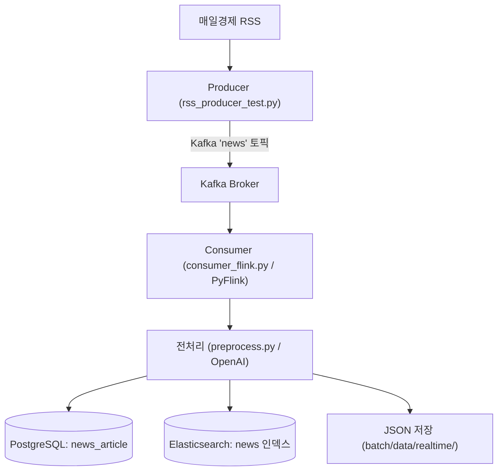

# Data Pipeline (data-pjt)

> 실시간 뉴스 수집 → 스트리밍 처리 → AI 전처리 → 저장으로 이어지는 데이터 파이프라인입니다.
> 상위 모노레포 개요는 [`../README.md`](../README.md)를 참고하세요.

---

## 개요

매일경제 RSS 피드 기반으로 뉴스를 실시간 수집하여 **Kafka**로 전송하고, **Flink(PyFlink)** 가 이를 소비하여 **OpenAI API**로 키워드 추출·임베딩·카테고리 분류를 수행한 뒤, **PostgreSQL** 과 **Elasticsearch** 에 저장하고 원본을 JSON으로 남깁니다.
배치 단계(Airflow + Spark)는 별도 환경으로 구성되어 있습니다 — [`batch/README.md`](./batch/README.md) 참고.

---

## 시스템 구성도


```mermaid
graph TD
A[매일경제 RSS] --> B["Producer (rss_producer_test.py)"]
B -->|Kafka 'news' 토픽| C[Kafka Broker]
C --> D["Consumer (consumer_flink.py / PyFlink)"]
D --> E["전처리 (preprocess.py / OpenAI)"]
E --> F[(PostgreSQL: news_article)]
E --> G[(Elasticsearch: news 인덱스)]
E --> H["JSON 저장 (batch/data/realtime/)"]
```

---

## 기술 스택

| 범주 | 기술 / 라이브러리 | 역할 |
| --- | --- | --- |
| 데이터 수집 | `feedparser`, `requests`, `beautifulsoup4` | 매일경제 RSS 및 본문 크롤링 |
| 메시징 | `kafka-python` (Apache Kafka) | 뉴스 데이터 비동기 전송 |
| 스트림 처리 | `apache-flink` 1.20 (PyFlink) | Kafka 수신 및 실시간 처리 |
| AI 전처리 | OpenAI `gpt-4o-mini`, `text-embedding-3-small`, `tiktoken` | 키워드 추출 · 임베딩(1536차원) · 카테고리 분류 |
| 저장소 | PostgreSQL (`psycopg2-binary`), Elasticsearch 8.17 | 전처리 결과 저장 / 색인 |
| 배치 | Apache Airflow 2.10.5, Apache Spark 3.5.4 | 일일 리포트 배치 환경 (`batch/`) |
| 기타 | `python-dotenv` | 환경 변수 관리 |

> 전체 의존성은 [`requirements.txt`](./requirements.txt) 참고.

---

## 폴더 구조

```plaintext
data-pjt/
├── producer/
│   ├── rss_producer_test.py    # RSS 수집 + 본문 크롤링 → Kafka 전송 (메인 Producer)
│   ├── scrape_link.py          # 매일경제 RSS 피드 링크 목록 추출
│   ├── deprecated.py           # (구버전) 사용 안 함
│   └── deprecated2.py          # (구버전) 사용 안 함
├── consumer/
│   ├── consumer_flink.py       # Kafka → Flink → 전처리 → PostgreSQL/Elasticsearch/JSON
│   ├── preprocess.py           # OpenAI 기반 키워드/임베딩/분류 함수
│   └── config/
│       └── flink-sql-connector-kafka-3.3.0-1.20.jar  # Kafka-Flink 연동 JAR
├── batch/                      # Airflow + Spark 배치 환경 → batch/README.md
│   ├── dags/daily_report_dag.py
│   ├── config/postgresql-42.7.3.jar
│   ├── data/realtime/*.json    # Consumer가 적재한 뉴스 JSON
│   ├── data/*.pdf              # 리포트 샘플
│   ├── Dockerfile.airflow
│   ├── Dockerfile.spark
│   └── docker-compose.yaml
├── requirements.txt
└── README.md
```

> Consumer는 전처리 결과 JSON을 `../batch/data/realtime/` (즉 `batch/data/realtime/`)에 저장합니다.

---

## 모듈 상세

### 1. Producer (`producer/rss_producer_test.py`)
- `scrape_link.get_mk_rss_links()`로 매일경제 RSS 피드 링크 목록을 수집
- `feedparser`로 메타데이터(제목, 링크, 발행일, 카테고리) 파싱
- `requests` + `BeautifulSoup`로 본문 및 기자명 크롤링 (`div.news_cnt_detail_wrap`)
- 뉴스 객체를 JSON 직렬화하여 Kafka `news` 토픽으로 전송 (약 1초 간격)

전송 데이터 예시:

```json
{
  "title": "경제 성장률, 하반기 반등 기대",
  "link": "https://www.mk.co.kr/news/economy/12345678",
  "write_date": "2025-04-18T05:19:50",
  "category": "경제",
  "content": "정부는 오늘…",
  "writer": "홍길동 기자"
}
```

### 2. Consumer (`consumer/consumer_flink.py`)
- `FlinkKafkaConsumer`로 Kafka `news` 토픽 구독 (연결 JAR: `KAFKA_CONNECTOR_PATH` 환경변수)
- 수신 데이터를 `preprocess` 모듈로 전처리 후 다음에 저장:
  - **PostgreSQL** `news_article` 테이블 INSERT
  - **Elasticsearch** `news` 인덱스 업데이트 (`http://localhost:9200`)
  - **JSON 파일** `../batch/data/realtime/news_YYYYMMDDHHMM.json`
- `embedding`이 NULL인 기사에 대해 임베딩을 보충하는 로직 포함
- 본문이 `[본문 없음]`인 경우 저장 생략, DB/파일 오류 시 로그 출력

### 3. 전처리 (`consumer/preprocess.py`)
| 함수 | 모델 | 역할 |
| --- | --- | --- |
| `preprocess_content` | `tiktoken` (cl100k_base) | 본문을 최대 5,000 토큰으로 제한 |
| `transform_extract_keywords` | `gpt-4o-mini` | 핵심 키워드 5개 추출 (명사 중심, 쉼표 구분) |
| `transform_to_embedding` | `text-embedding-3-small` | 1536차원 임베딩 벡터 생성 |
| `transform_classify_category` | `gpt-4o-mini` | 17개 카테고리 중 1개 분류 (미해당 시 `미분류`) |

---

## 환경 변수 (`.env`)

```env
DB_USERNAME=your_postgres_user
DB_PASSWORD=your_postgres_password
KAFKA_CONNECTOR_PATH=/절대경로/consumer/config/flink-sql-connector-kafka-3.3.0-1.20.jar
OPENAI_API_KEY=your_openai_api_key
```

---

## 실행 순서

1. PostgreSQL 기동 및 `news_article` 테이블 준비
2. Elasticsearch 기동 (`http://localhost:9200`)
3. Kafka(및 Zookeeper) 기동, `news` 토픽 준비
4. Consumer 실행 (`python consumer/consumer_flink.py`)
5. Producer 실행 (`python producer/rss_producer_test.py`)

> 이후 실시간 수집 → 전처리 → 저장이 자동으로 진행됩니다.
> 배치(Airflow + Spark) 환경 실행은 [`batch/README.md`](./batch/README.md)를 참고하세요.

---

## 향후 확장 방향
- 임베딩 기반 유사 기사 추천 고도화 (백엔드 pgvector 연동)
- 뉴스 요약 / 감성 분석 / 트렌드 분석 모델 연계
- 배치 리포트 자동화 완성 (`batch/dags/scripts/spark_daily_report.py` 구현)

---

## 히스토리 / 회고

> 아래는 초기 설계 단계의 기록으로, **현재 코드와 다를 수 있습니다.** 참고용 회고입니다.

- **초기(2025-04-11)**: 단일 스크립트(`main.py`) 기반 ETL. 키워드 추출은 **TF-IDF(scikit-learn)**, 임베딩은 **KoSBERT(`jhgan/ko-sbert-nli`, sentence-transformers)** 를 사용. 이후 OpenAI API 기반으로 전환됨.
- **2025-04-18**: Kafka + PyFlink 스트리밍 구조 및 OpenAI(gpt-4o-mini, text-embedding-3-small) 전처리로 전환. 현재 구조의 기반.
- 현재: 위 전처리 결과를 PostgreSQL과 더불어 **Elasticsearch**에도 색인하며, 원본은 `batch/data/realtime/`에 JSON으로 보관.
