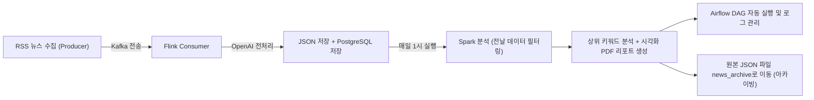
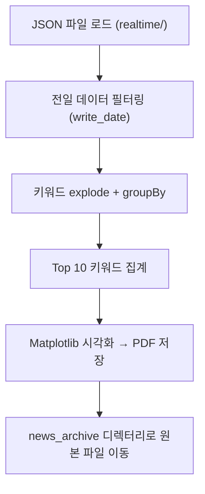
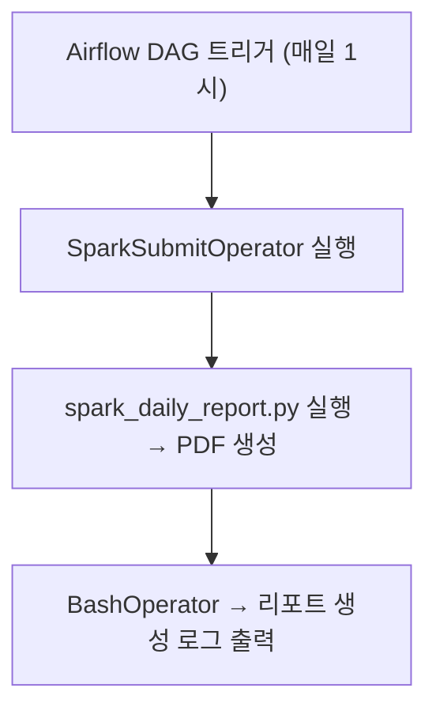

🧾 \[1\] 프로젝트 개요 및 목적
---------------------

### 📌 프로젝트명

**배치처리 워크플로우 파이프라인 구축**

### 🎯 프로젝트 개요

본 프로젝트는 실시간으로 수집된 뉴스 데이터를 대상으로, Apache Kafka, Flink, Spark, Airflow, OpenAI API 등 다양한 기술을 통합하여 **자동화된 배치 처리 파이프라인**을 구축하는 것을 목표로 하였다. 특히, 매일 생성되는 JSON 형태의 뉴스 데이터를 전처리·분석한 뒤, 시각적 리포트로 자동 생성하고, 원본 데이터를 체계적으로 아카이빙함으로써 **데이터 관리의 자동화, 시각화, 확장성 확보**를 중점적으로 구현하였다.

* * *

### 🧭 목표

*   **Airflow를 활용한 워크플로우 스케줄링**
    
*   **Spark 기반 전일 뉴스 데이터 분석 및 PDF 리포트 자동 생성**
    
*   **Kafka → Flink 기반의 실시간 뉴스 수신 및 처리**
    
*   **원본 데이터 자동 아카이빙 처리**
    
*   **DB 적재 및 벡터 임베딩 등 2차 가공 기반 마련**
    

* * *

### 💡 구현 포인트 요약

| 구성 요소 | 기능 요약 |
| --- | --- |
| `Producer` | RSS 뉴스 수집 후 Kafka로 송신 |
| `Consumer` | Kafka 수신 → GPT 기반 전처리 → PostgreSQL 저장 + JSON 저장 |
| `Batch` | Spark를 통해 전날 데이터 분석 → 키워드 집계 → PDF 리포트 생성 |
| `Airflow` | DAG 기반으로 매일 1시 자동 실행 |
| `아카이빙` | 사용된 JSON 파일을 별도 디렉토리로 이동해 데이터 관리 최적화 |


* * *

🧾 \[2\] 전체 시스템 구성 및 기술 스택
--------------------------

### 🔧 전체 아키텍처 개요

이 프로젝트는 **실시간 데이터 수집부터 배치 리포트 생성까지 전 과정을 자동화**한 파이프라인이다.  
Kafka와 Flink를 통해 실시간 스트리밍 데이터를 수집하고, Spark를 통해 분석 및 시각화를 수행하며, Airflow를 통해 정기적 스케줄링을 관리한다.

* * *

### 🗂 시스템 아키텍처 흐름도



* * *

### 🛠 사용 기술 스택

| 범주 | 기술 / 라이브러리 | 주요 역할 |
| --- | --- | --- |
| 데이터 수집 | `feedparser`, `BeautifulSoup` | RSS 기반 뉴스 크롤링 |
| 메시징 시스템 | `Apache Kafka` | 뉴스 데이터를 비동기 전송 |
| 실시간 처리 | `Apache Flink`, `pyflink` | Kafka에서 데이터 수신 후 처리 |
| AI 처리 | `OpenAI GPT-4o-mini`, `text-embedding-3-small` | 키워드 추출, 임베딩 벡터화, 카테고리 분류 |
| 저장소 | `PostgreSQL` | 전처리된 뉴스 데이터 저장 |
| 배치 분석 | `Apache Spark`, `PySpark` | 하루치 JSON 데이터 분석 및 키워드 집계 |
| 리포트 시각화 | `Matplotlib`, `PdfPages` | 키워드 차트 → PDF 리포트 생성 |
| 자동화 오케스트레이션 | `Apache Airflow` | Spark 작업 자동화 및 작업 상태 관리 |
| 기타 | `dotenv`, `shutil`, `os`, `argparse` | 환경 변수, 디렉터리 제어 등 유틸리티 |

* * *

### 📁 디렉터리 구조 개요

```plaintext
DATA-PJT/
├── producer/            # RSS → Kafka
├── consumer/            # Kafka → 전처리 → 저장
├── batch/               
│   ├── dags/scripts/    # Airflow + Spark 리포트
│   ├── data/realtime/   # Flink 저장 JSON
│   ├── data/news_archive/ # 분석 완료 후 이동
│   └── data/*.pdf       # 생성된 PDF 리포트
└── docker-compose.yaml  # 실행 환경 정의
```


🧾 \[3-1\] Producer 모듈 – 뉴스 수집 및 Kafka 전송
-----------------------------------------

### 🎯 목적

국내 언론사(RSS 기반)의 뉴스 데이터를 실시간으로 수집하고, Kafka 토픽을 통해 downstream(소비자)에게 전송하기 위한 데이터 송신자 역할 수행.

* * *

### 🔨 주요 구성 요소

| 파일명 | 설명 |
| --- | --- |
| `rss_producer_test.py` | Producer 실행 스크립트 |
| `scrape_link.py` | 매일경제 RSS 피드 목록 추출 모듈 |

* * *

### 🔁 흐름 요약

```mermaid
graph TD
A[매일경제 RSS 페이지 접속] --> B[RSS 링크 목록 수집 (scrape_link.py)]
B --> C[feedparser로 기사 메타데이터 파싱]
C --> D[기사 본문, 기자 정보 크롤링 (BeautifulSoup)]
D --> E[뉴스 객체 생성 → Kafka "news" 토픽 전송]
```

* * *

### 💡 주요 구현 포인트

#### ✅ 1. RSS 목록 수집

```python
# scrape_link.py
def get_mk_rss_links():
    soup = BeautifulSoup(requests.get("https://www.mk.co.kr/rss").text, "html.parser")
    return [a['href'] for a in soup.find_all("a", class_="rss_link")]
```

#### ✅ 2. 기사 본문 및 기자 정보 추출

```python
# rss_producer_test.py
wrapper = soup.find("div", class_="news_cnt_detail_wrap")
paragraphs = wrapper.find_all("p")
content = "\n\n".join(p.get_text(strip=True) for p in paragraphs)
```

#### ✅ 3. Kafka 전송

```python
# KafkaProducer 사용
producer.send(TOPIC, value=news_data)
```

*   **송신 주기:** `1초 간격` (`time.sleep(1)`)
    
*   **데이터 형식:** JSON 직렬화 후 UTF-8 인코딩
    

* * *

### 📦 전송 데이터 구조 예시

```json
{
  "title": "삼성전자, 반도체 사업 투자 확대",
  "link": "https://www.mk.co.kr/news/some-url",
  "write_date": "2025-05-01T08:35:00",
  "category": "경제",
  "content": "삼성전자는 오늘...",
  "writer": "홍길동"
}
```


🧾 \[3-2\] Consumer 모듈 – Kafka 수신, GPT 전처리, 저장
----------------------------------------------

### 🎯 목적

Kafka로 송신된 뉴스 데이터를 Flink를 통해 실시간으로 수신하고, OpenAI API를 활용해 **자연어 기반 전처리**(키워드 추출, 임베딩, 카테고리 분류)를 수행한 후, 결과를 **PostgreSQL 및 JSON 파일로 저장**한다.

* * *

### 🧩 주요 구성 파일

| 파일명 | 역할 |
| --- | --- |
| `consumer_flink.py` | Flink 스트리밍 환경 설정 및 처리 파이프라인 구현 |
| `preprocess.py` | OpenAI API를 이용한 전처리 함수 모음 |

* * *

### 🔁 전체 흐름 요약

```mermaid
flowchart TD
A['Kafka "news" 토픽'] --> B[FlinkKafkaConsumer 수신]
B --> C["process_and_save() → JSON 파싱"]
C --> D1["GPT-4o로 키워드/카테고리 분류"]
C --> D2[임베딩 벡터화]
D1 --> E1[PostgreSQL 저장]
D2 --> E2["JSON 파일 저장 (realtime/)"]
```

* * *

### 🔍 핵심 구현 설명

#### ✅ Kafka 수신 설정 (`consumer_flink.py`)

```python
consumer = FlinkKafkaConsumer(
    topics='news',
    deserialization_schema=SimpleStringSchema(),
    properties=kafka_props
)
stream = env.add_source(consumer)
```

#### ✅ 전처리 로직 (`preprocess.py`)

*   **토큰 길이 제한**: 5,000 토큰 초과 시 잘라냄
    
*   **GPT 기반 키워드 추출**
    

```python
transform_extract_keywords(text)  # → ["경제", "투자", ...]
```

*   **임베딩 생성**
    

```python
transform_to_embedding(text)  # → [0.123, -0.445, ...] 1536차원
```

*   **카테고리 분류**
    

```python
transform_classify_category(content)  # → "정치"
```

#### ✅ 결과 저장

*   **PostgreSQL** (테이블: `news_article`)
    

```python
cur.execute(
  INSERT INTO news_article (...),  # title, writer, category, embedding 등
)
```

*   **JSON 파일 저장** (`/batch/data/realtime/news_YYYYMMDDHHMM.json`)
    

```python
with open(filepath, "w") as f:
    json.dump([...])
```

* * *

### 💾 저장 구조 예시

| 필드명 | 설명 |
| --- | --- |
| title | 뉴스 제목 |
| writer | 작성자 |
| write\_date | 작성일시 |
| category | GPT 기반 분류 결과 |
| keywords | 키워드 리스트 |
| embedding | GPT 임베딩 벡터 |
| content | 기사 본문 |
| link | 원문 링크 |

* * *

### ⚠️ 예외 처리

*   본문이 `[본문 없음]`일 경우 → 저장 생략
    
*   DB 오류, 파일 저장 오류 시 로그 출력
    


🧾 \[3-3\] Batch 모듈 – Spark 기반 분석 및 자동 리포트 생성
---------------------------------------------

### 🎯 목적

Kafka-Flink로 수신된 뉴스 데이터를 하루 단위로 분석하여 **상위 키워드 통계 및 시각화 리포트(PDF)** 를 생성하고, 이후 원본 JSON 파일을 자동으로 아카이빙하여 데이터 관리 체계를 확립한다.

* * *

### 🧩 주요 구성 파일

| 파일명 | 설명 |
| --- | --- |
| `spark_daily_report.py` | Spark 배치 스크립트 – 분석, 시각화, 리포트 저장, 아카이빙 처리 |
| `daily_report_dag.py` | Airflow DAG 설정 – 매일 1시 실행 스케줄링 |

* * *

### 🔁 처리 흐름 요약



* * *

### 🔍 핵심 구현 상세

#### ✅ 1. 날짜 필터링

*   `--date` 인자로 받은 날짜 기준
    
*   `write_date` 기준으로 00:00 ~ 24:00 사이 기사만 필터링
    

```python
filtered_df = df.filter(
    (col("write_date_ts") >= start) & 
    (col("write_date_ts") < end)
)
```

* * *

#### ✅ 2. 키워드 통계 집계

*   `keywords` 컬럼 explode 후 count 집계
    
*   상위 10개 키워드 추출
    

```python
df_exploded = df.select(explode("keywords").alias("keyword"))
top_keywords = df_exploded.groupBy("keyword").count().orderBy("count", ascending=False).limit(10)
```

* * *

#### ✅ 3. PDF 리포트 생성

*   한글 폰트 설정 (`NanumGothic`)
    
*   `matplotlib`로 막대그래프 생성
    
*   날짜 기반 파일명 예시: `daily_report_20250501.pdf`
    

```python
with PdfPages(report_file_path) as pdf:
    plt.bar(...); pdf.savefig(); plt.close()
```

* * *

#### ✅ 4. JSON 아카이빙

*   `realtime/` 디렉터리 내 모든 `.json` 파일을
    
*   `news_archive/`로 이동 (`shutil.move` 사용)
    

```python
for file in files:
    shutil.move(src, dst)
```

* * *

### 🧾 리포트 예시

*   제목: `Top 10 Keywords`
    
*   축: Keyword (X), 빈도수 (Y)
    
*   저장 경로: `/opt/airflow/data/daily_report_YYYYMMDD.pdf`
    

* * *

### 🛡 예외 및 유효성 처리

*   기사 수가 0 → 리포트 생성 생략
    
*   키워드 없음 → 리포트 생성 생략
    
*   PDF 저장/파일 이동 실패 시 로그 출력
    


🧾 \[3-4\] 스케줄링 모듈 – Airflow DAG 자동화 및 실행 흐름
--------------------------------------------

### 🎯 목적

Spark 분석과 PDF 리포트 생성을 **정해진 시간에 자동 실행**하기 위해 Apache Airflow를 활용하여 배치 워크플로우를 구성하고, **작업의 실행/상태/실패 여부를 관리**하는 자동화 체계를 구축하였다.

* * *

### 🧩 구성 파일

| 파일명 | 설명 |
| --- | --- |
| `daily_report_dag.py` | Spark 분석을 매일 새벽 1시에 실행하도록 설정된 DAG |
| `spark_daily_report.py` | DAG에서 실행되는 Spark 애플리케이션 스크립트 |

* * *

### 🔁 전체 흐름



* * *

### 🔧 DAG 세부 구성

#### ✅ DAG 기본 설정

```python
default_args = {
    'owner': 'airflow',
    'retries': 1,
    'retry_delay': timedelta(minutes=5)
}

with DAG(
    dag_id='daily_report_dag',
    schedule_interval='0 1 * * *',  # 매일 새벽 1시
    start_date=datetime(2025, 5, 1),
    catchup=False
) as dag:
```

* * *

#### ✅ SparkSubmitOperator

*   Spark 실행 파일: `/opt/airflow/dags/scripts/spark_daily_report.py`
    
*   인자 전달: `--date {{ ds }}` → DAG 실행일이 자동 전달됨
    
*   PostgreSQL 드라이버 JAR 필요 (Spark JDBC 연결 대비)
    

```python
submit_spark_job = SparkSubmitOperator(
    application='/opt/airflow/dags/scripts/spark_daily_report.py',
    application_args=['--date', '{{ ds }}'],
    jars="/opt/bitnami/spark/jars/postgresql-42.7.3.jar"
)
```

* * *

#### ✅ 후속 Bash 알림 태스크

*   간단한 완료 메시지 출력
    
*   추후 이메일/Slack 알림으로 확장 가능
    

```python
notify_report_generated = BashOperator(
    task_id='notify_report_generated',
    bash_command='echo "리포트가 생성되었습니다: {{ ds }}"'
)
```

* * *

### 📋 실행 결과 관리

*   DAG 성공/실패 여부는 **Airflow UI에서 실시간 확인 가능**
    
*   리포트 누락, Spark 실패 등 발생 시 에러 로그 추적 가능
    
*   재실행 및 개별 태스크 수동 실행 가능
    

* * *

### 💡 유연성 및 확장성

| 항목 | 설명 |
| --- | --- |
| 📅 `schedule_interval` | Cron 표현식으로 조정 가능 (`@daily`, `@hourly`, etc.) |
| 📩 알림 연동 | EmailOperator, SlackWebhookOperator 등으로 확장 가능 |
| 📁 파일 관리 | DAG 내 후속 작업으로 자동 아카이빙, 정리, 통계화 가능 |


🧾 \[4\] 프로젝트 구현 결과 및 성과
------------------------

### ✅ 전체 파이프라인 정상 작동

본 프로젝트는 RSS 뉴스 수집부터 Kafka 전송, Flink 실시간 소비, GPT 기반 전처리, Spark 분석, Airflow 스케줄링까지 **데이터의 전 주기 흐름이 자동화된 파이프라인**으로 성공적으로 구현되었다. 모든 모듈이 유기적으로 연결되어 매일 전일 데이터를 바탕으로 정기적으로 분석 및 리포트가 생성되며, 운영자가 개입하지 않아도 **스스로 수집·분석·저장·시각화가 순환**되도록 설계되었다.

* * *

### 📊 구현 결과 요약

| 항목 | 결과 |
| --- | --- |
| 뉴스 수집 | RSS 기반으로 10개 이상의 피드 자동 수집 |
| Kafka 전송 | 약 1초 간격으로 기사 데이터 전송 성공 |
| Flink 수신 | 실시간 수신 및 JSON + DB 저장 동시 진행 |
| GPT 전처리 | 키워드 추출, 임베딩, 카테고리 분류 모두 안정적 수행 |
| Spark 분석 | 하루 기준 기사 수 필터링, 키워드 집계 정확히 수행 |
| 리포트 생성 | `Top 10 키워드` 그래프가 포함된 PDF 저장 성공 |
| 파일 아카이빙 | `.json` 파일을 분석 후 자동 이동 처리 완료 |
| Airflow 스케줄링 | DAG 자동 실행 및 상태 추적 정상 작동 확인 |

* * *

### 🗂 산출물 및 파일 예시

*   PDF 파일: `/batch/data/daily_report_20250501.pdf`
    
*   원본 JSON: `/batch/data/realtime/news_202505010100.json`
    
*   아카이빙 디렉터리: `/batch/data/news_archive/`
    
*   PostgreSQL 테이블: `news_article` (전처리 결과 저장)
    
*   Airflow DAG: `daily_report_dag` (매일 1시 실행)
    

* * *

### 🎯 주요 성과 정리

| 카테고리 | 성과 내용 |
| --- | --- |
| **자동화** | 수동 개입 없이 전 과정을 자동으로 반복 실행 가능 |
| **정확성** | GPT 기반 전처리와 Spark 분석을 통해 의미 있는 결과 도출 |
| **가시성** | PDF 기반의 시각 리포트 제공으로 결과 해석 용이 |
| **관리 용이성** | 데이터 아카이빙으로 누적 관리 및 추후 분석 기반 마련 |
| **확장성** | DB 기반 피처 엔지니어링, 추천 시스템, 알림 기능 등 추가 가능성 확보 |


🧾 \[5\] 프로젝트 회고 및 확장 방향
------------------------

### 🪞 프로젝트 회고

이번 프로젝트는 단순한 배치 작업을 넘어서, **실시간 수집 → 자연어 처리 기반 분석 → 시각화 및 자동 리포트 생성**이라는 전체 흐름을 경험해보는 좋은 기회였다. 특히 Apache Airflow와 Spark, Kafka, GPT 기반의 AI 전처리를 통합적으로 다루면서, 데이터 엔지니어링과 데이터 분석의 경계에 있는 핵심 기술들을 체험하고 실습하였다.

* * *

### 💡 회고 키워드별 정리

| 항목 | 회고 내용 |
| --- | --- |
| **기술 통합** | Kafka, Flink, Spark, Airflow, OpenAI API를 단일 파이프라인 내에서 유기적으로 연결함 |
| **자동화 경험** | DAG 설계와 SparkSubmitOperator를 통해 실제 배치 시스템의 운영 경험 확보 |
| **실무 감각** | 파일 처리, 스케줄링, 아카이빙 등 백엔드 파이프라인 구성에 대한 실무 감각을 익힘 |
| **에러 핸들링** | 데이터 누락, 저장 실패, 외부 API 오류 등 다양한 예외를 실시간 처리하고 대응하는 경험 |
| **시각화 설계** | 데이터 분석 결과를 의미 있게 전달하기 위한 리포트 구성 방법에 대한 이해도 향상 |

* * *

### 🚀 향후 확장 방향

본 프로젝트는 확장 가능한 구조로 설계되었기 때문에, 다양한 방향으로 다음 단계를 발전시킬 수 있다.

#### 📈 1. 분석 기능 고도화

*   GPT 기반 요약, 감성 분석, Named Entity Recognition(NER) 도입
    
*   유사 뉴스 클러스터링 및 트렌드 감지 기능 추가
    

#### 📬 2. 리포트 활용 범위 확대

*   PDF 외 HTML 대시보드 또는 Slack/Email 자동 알림 연동
    
*   Airflow 알림 기능 (Slack, EmailOperator) 활용
    

#### 🧠 3. 추천 시스템 연계

*   저장된 임베딩 벡터 기반으로 뉴스 추천 알고리즘 설계
    
*   사용자 피드백을 반영한 개인화 추천 모델 접목 가능
    

#### 🏗 4. 클라우드 환경으로 전환

*   AWS S3, RDS, EMR, Cloud Composer 등과 연계하여 인프라 확장
    
*   대용량 스트리밍 처리 및 분산 분석 성능 실험
    

