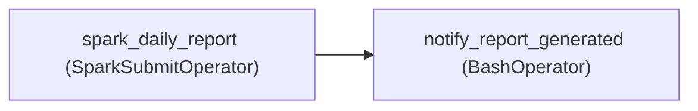

# Batch - Airflow + Spark 배치 처리 환경

> 이 문서는 `data-pjt/batch` 범위(Airflow + Spark 기반 배치 처리 환경)만 다룹니다.
> 전체 데이터 파이프라인(Producer → Consumer)에 대한 설명은 [`../README.md`](../README.md)를 참고하세요.

---

## 개요

`batch` 디렉토리는 **Apache Airflow(2.10.5)** 와 **Apache Spark(3.5.4)** 를 Docker Compose로 통합 구동하는 배치 처리 환경입니다.
Consumer 단계에서 `data/realtime/`에 적재된 뉴스 JSON 파일을 대상으로, 전일 데이터를 분석하여 일일 리포트(PDF)를 생성하는 배치 워크플로우를 스케줄링하는 것을 목표로 합니다.

> **현재 구현 상태 (중요)**
> - Airflow + Spark + PostgreSQL을 띄우는 Docker 환경(`docker-compose.yaml`, `Dockerfile.airflow`, `Dockerfile.spark`)과
>   매일 새벽 1시에 실행되도록 정의된 DAG(`dags/daily_report_dag.py`)는 **구현되어 있습니다.**
> - 단, DAG가 실행 대상으로 참조하는 Spark 스크립트
>   **`/opt/airflow/dags/scripts/spark_daily_report.py` 는 현재 레포지토리에 존재하지 않습니다.**
>   즉, DAG의 `spark_daily_report` 태스크는 **아직 동작하지 않는 미구현(예정) 상태**입니다.
> - `data/daily_report_20250430.pdf`, `data/daily_report_20250502.pdf` 는 과거에 생성된 **결과물 샘플**이며,
>   현재 코드만으로 자동 재생성되지는 않습니다.

---

## 디렉토리 구조

```plaintext
batch/
├── dags/
│   └── daily_report_dag.py        # Airflow DAG (매일 1시, SparkSubmit → 알림)
│                                  # ※ dags/scripts/spark_daily_report.py 참조하나 미구현
├── config/
│   └── postgresql-42.7.3.jar      # Spark JDBC용 PostgreSQL 드라이버 JAR
├── data/
│   ├── realtime/                  # Consumer가 적재한 뉴스 JSON (news_*.json)
│   │   └── news_YYYYMMDDHHMM.json
│   ├── daily_report_20250430.pdf  # 생성된 리포트 샘플 (과거 산출물)
│   └── daily_report_20250502.pdf
├── Dockerfile.airflow             # Airflow 2.10.5 + Spark/Java/한글폰트 설치 이미지
├── Dockerfile.spark               # bitnami/spark:3.5.4 + matplotlib/한글폰트 이미지
├── docker-compose.yaml            # Airflow(Celery) + Redis + Postgres + Spark Master/Worker
├── airflow_spark_docker_guide.md  # Docker 환경 구축 상세 가이드
└── README.md                      # 본 문서
```

> 참고: `docker-compose.yaml`은 `dags/scripts/`, `logs/`, `plugins/`, `output/` 디렉토리를 볼륨으로 마운트합니다.
> 해당 디렉토리는 실행 전 생성이 필요할 수 있으며, 자세한 내용은 [`airflow_spark_docker_guide.md`](./airflow_spark_docker_guide.md)를 참고하세요.

---

## 기술 스택

| 범주 | 기술 / 버전 | 역할 |
| --- | --- | --- |
| 오케스트레이션 | Apache Airflow 2.10.5 (CeleryExecutor) | DAG 기반 배치 스케줄링 |
| 분산 처리 | Apache Spark 3.5.4 (Standalone Master/Worker) | 일일 뉴스 데이터 분석(예정) |
| 메시지 브로커 | Redis 7.2 | Celery 브로커 |
| 메타데이터 DB | PostgreSQL 13 (호스트 5433 포트) | Airflow 메타데이터 저장 |
| JDBC 드라이버 | postgresql-42.7.3.jar | Spark ↔ PostgreSQL 연동용 |
| 시각화 | Matplotlib, fonts-nanum | 리포트(PDF) 생성용(예정) |
| 컨테이너 | Docker Compose | 통합 실행 환경 |

---

## Docker Compose 실행

> 상세 절차 및 초기 디렉토리/권한 설정은 [`airflow_spark_docker_guide.md`](./airflow_spark_docker_guide.md)를 참고하세요.
> 아래는 `batch/` 디렉토리에서 실행하는 것을 가정합니다.

```bash
# 1. (최초 1회) Airflow UID 환경변수 설정
echo "AIRFLOW_UID=$(id -u)" > .env

# 2. 필요한 마운트 디렉토리 생성 (없을 경우)
mkdir -p ./dags ./logs ./plugins ./config ./dags/scripts ./data ./output

# 3. Airflow 메타데이터 DB 초기화 및 관리자 계정 생성
docker compose up airflow-init

# 4. 전체 서비스 기동 (Airflow + Redis + Postgres + Spark Master/Worker)
docker compose up -d
```

### 접속 정보

| 서비스 | 주소 | 계정 |
| --- | --- | --- |
| Airflow Web UI | http://localhost:8080 | airflow / airflow |
| Spark Master UI | http://localhost:8083 | - |
| Spark Worker UI | http://localhost:8084 | - |
| PostgreSQL | localhost:5433 | airflow / airflow |

---

## DAG: `daily_report_dag`

`dags/daily_report_dag.py`에 정의된 일일 리포트 생성 DAG입니다.

| 항목 | 값 |
| --- | --- |
| `dag_id` | `daily_report_dag` |
| 스케줄 | `0 1 * * *` (매일 새벽 1시, Asia/Seoul) |
| `catchup` | `False` |
| 재시도 | 1회 (5분 간격) |

### 태스크 흐름


```mermaid
graph LR
A["spark_daily_report (SparkSubmitOperator)"] --> B["notify_report_generated (BashOperator)"]
```

1. **`spark_daily_report`** — `SparkSubmitOperator`로 Spark 작업을 제출합니다.
   - `application`: `/opt/airflow/dags/scripts/spark_daily_report.py` *(현재 미구현 — 실행 시 파일 없음 오류 발생)*
   - `conn_id`: `spark_default`
   - `application_args`: `['--date', '{{ ds }}']` (DAG 실행일 전달)
   - `jars`: `/opt/bitnami/spark/jars/postgresql-42.7.3.jar`
2. **`notify_report_generated`** — `BashOperator`로 완료 메시지를 출력합니다. (추후 Email/Slack 알림으로 확장 가능)

> Spark Connection(`spark_default`) 설정값(Host `spark://spark-master`, Port `7077`, Deploy mode `client` 등)은
> [`airflow_spark_docker_guide.md`](./airflow_spark_docker_guide.md)의 "SparkSubmitOperator 설정 예시" 절을 참고하세요.

---

## 향후 작업

- [ ] `dags/scripts/spark_daily_report.py` 구현 (전일 데이터 필터링 → 키워드 집계 → Matplotlib 기반 PDF 리포트 생성 → 원본 JSON 아카이빙)
- [ ] DAG `notify_report_generated` 태스크를 EmailOperator/SlackWebhookOperator로 확장
